# Windows 11 Security Hardening Lab

## Overview

This project documents the process of hardening a Windows 11 virtual machine by implementing several basic security controls and validating security configurations.

The objective was to simulate common system administration and IT support tasks related to endpoint security, user management, encryption, and auditing.

---

## Technologies Used

- Windows 11 Pro
- VMware Workstation
- Microsoft Defender
- Windows Firewall
- BitLocker Drive Encryption
- Event Viewer
- Local User Management
- Git
- Github

---

## Skills Demonstrated

- Windows endpoint hardening
- Security configuration validation
- Least privilege implementation
- User account management
- Drive encryption deployment
- Security event log analysis
- IT troubleshooting and documentation

---

## Security Controls Implemented

### 1. Verified Microsoft Defender Protection

Validated Windows Defender status and threat protection settings.

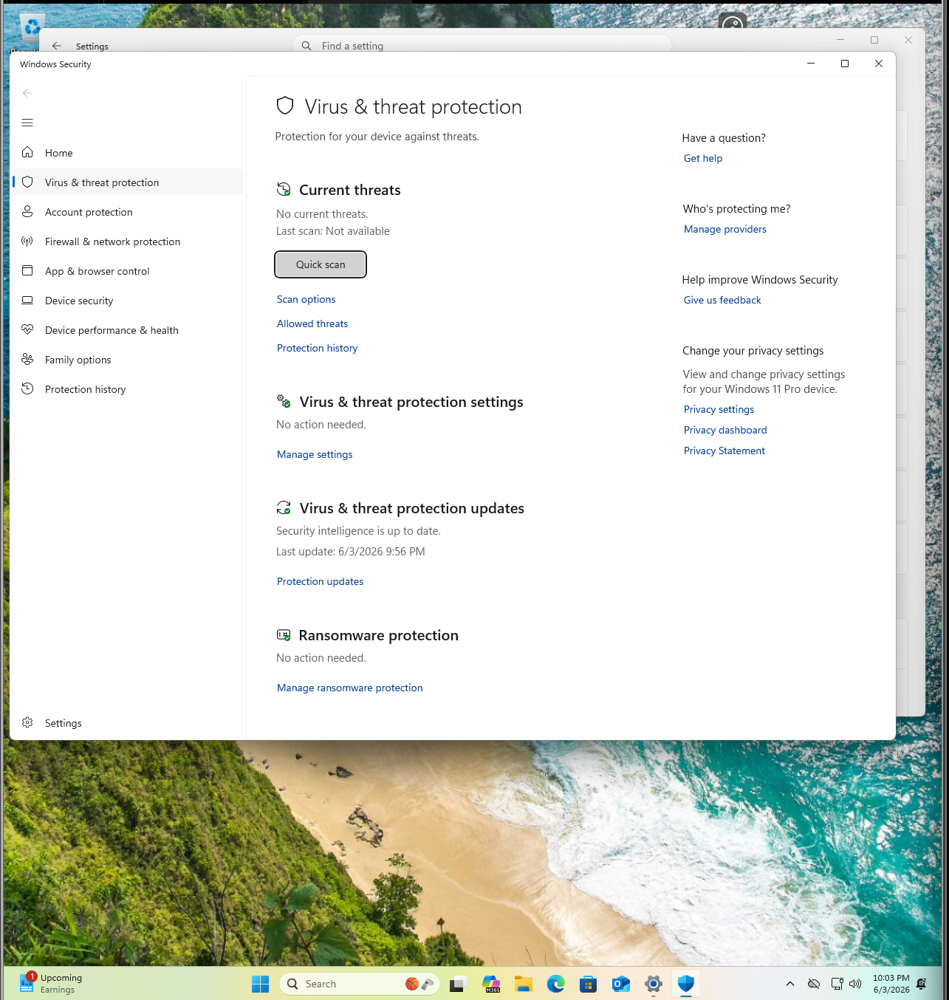

---

### 2. Verified Windows Firewall Configuration

Confirmed firewall protection was enabled for active network profiles.

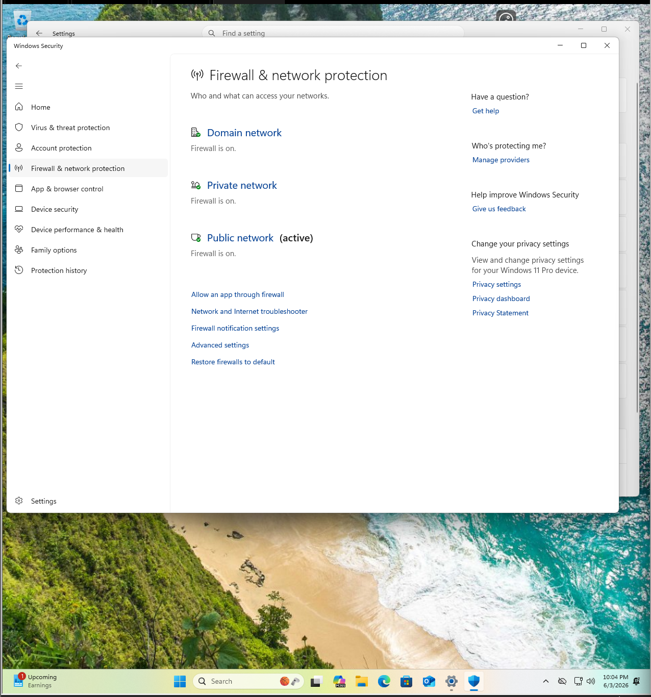

---

### 3. Created Standard User Account

Created a separate non-administrative account following the principle of least privilege.

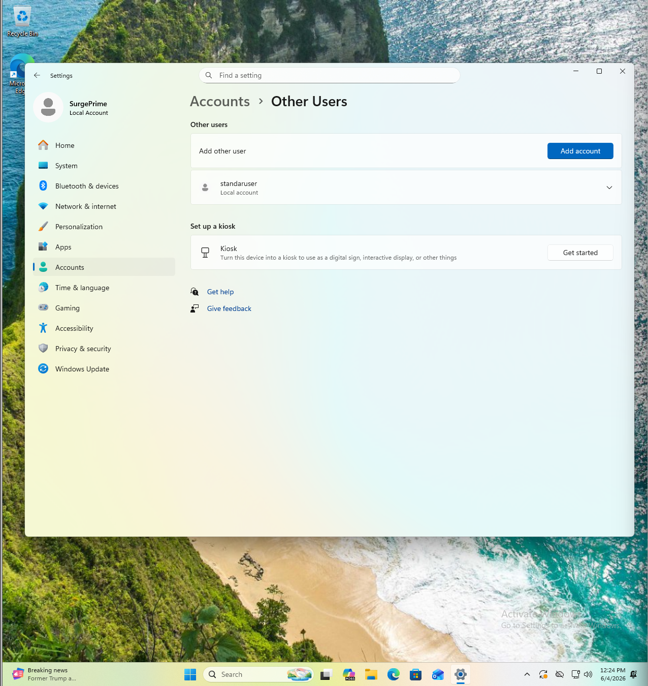

---

### 4. Verified Standard User Permissions

Confirmed the account was configured as a Standard User rather than an Administrator.

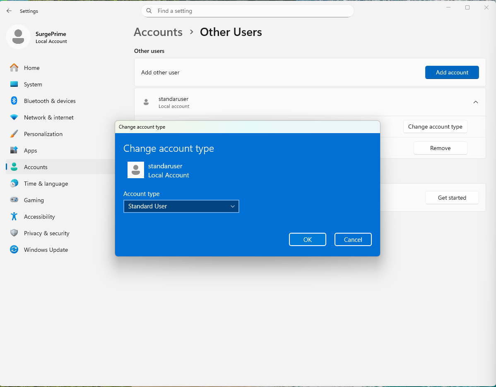

---

### 5. Tested Standard User Login

Validated successful login using the newly created standard account.

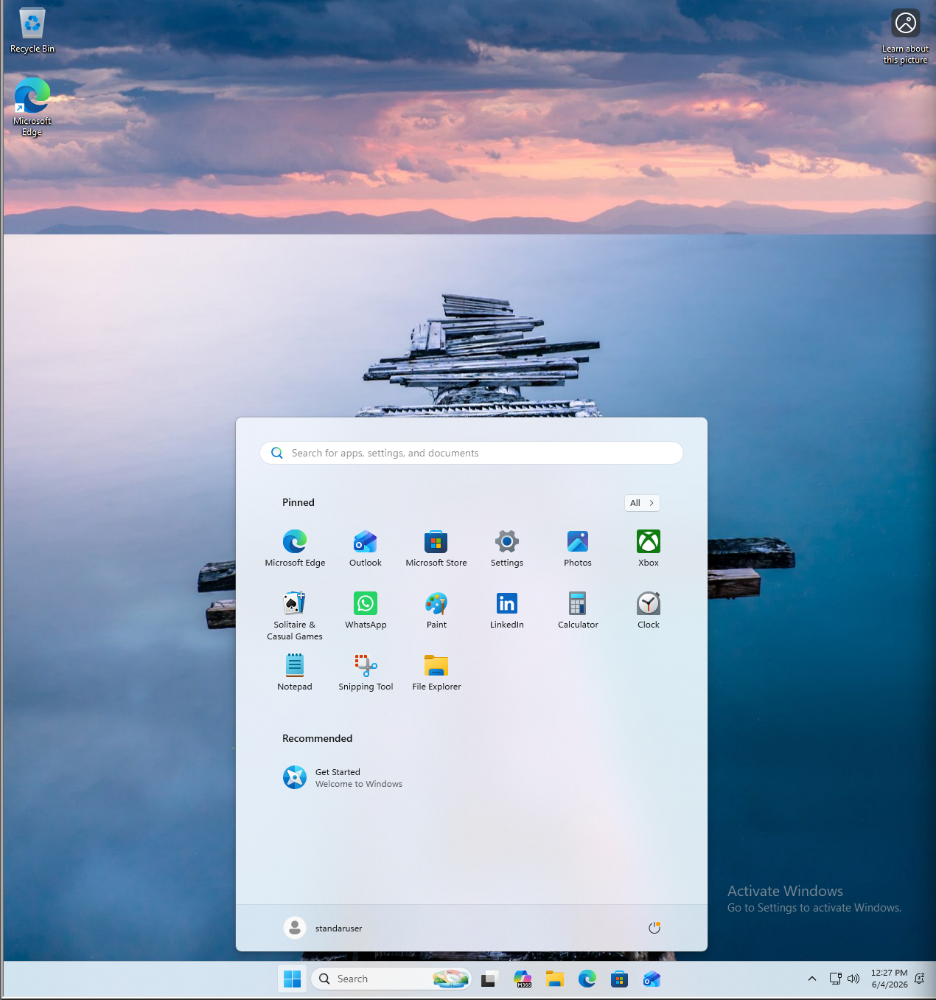

---

### 6. Reviewed Device Security Settings

Reviewed Windows device security protections.

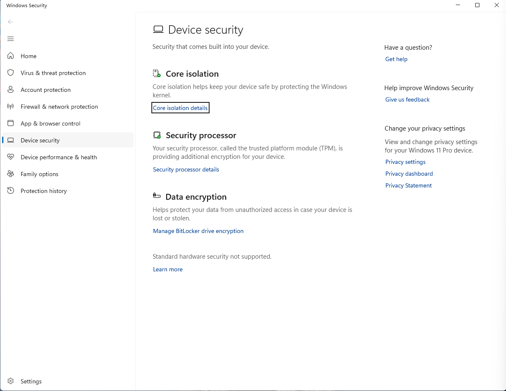

---

### 7. Checked Memory Integrity Status

Documented the original configuration.

#### Before

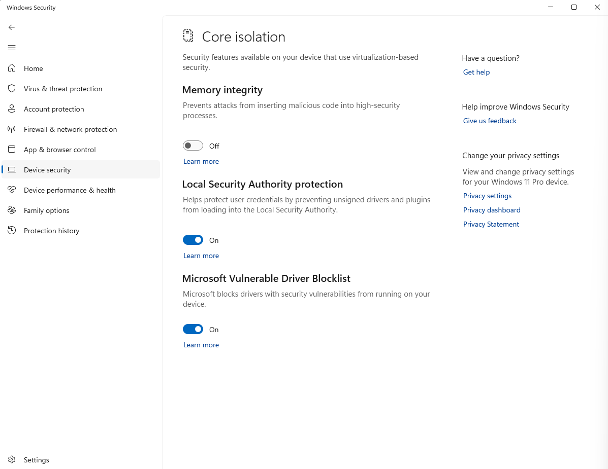

#### After

Enabled Memory Integrity to strengthen kernel-level protection.

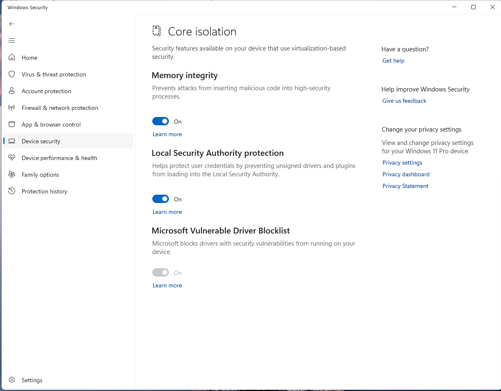

---

### 8. Configured BitLocker Drive Encryption

Encountered and resolved a configuration issue caused by attached bootable media.

#### Troubleshooting

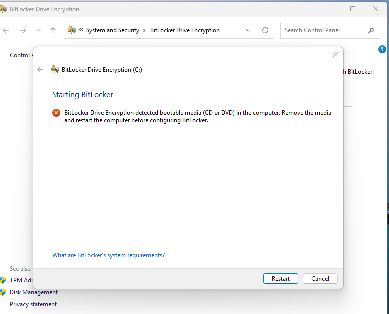

#### Encryption In Progress

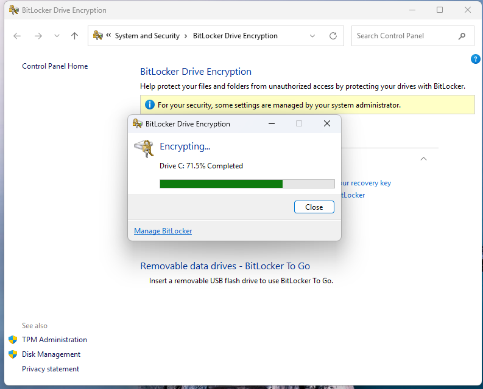

#### Encryption Completed

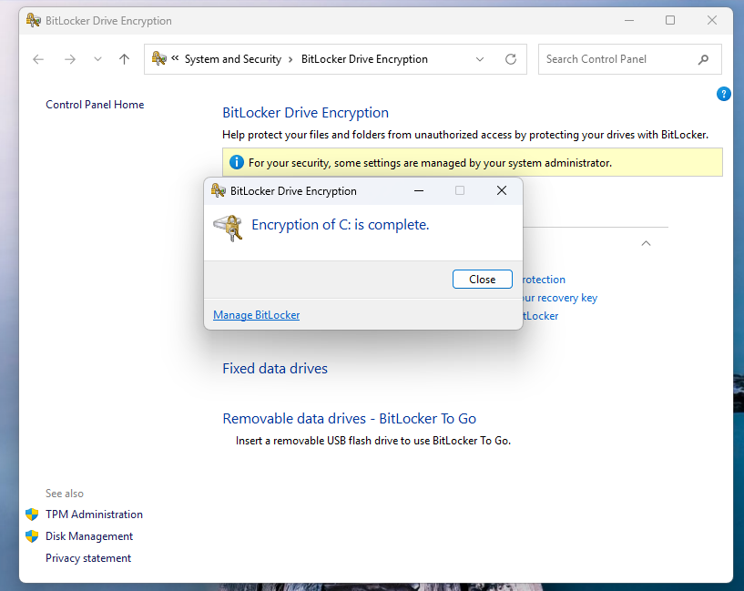

---

### 9. Security Log Validation

Attempted access using insufficient privileges and confirmed access restrictions.

#### Access Denied

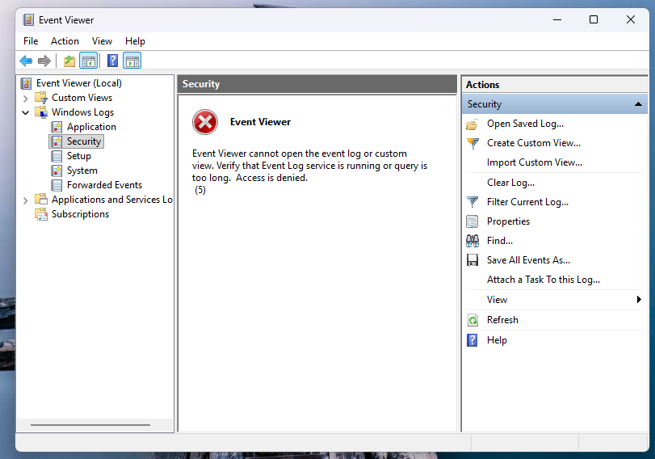

#### Administrative Access

Successfully reviewed Security logs using administrative privileges.

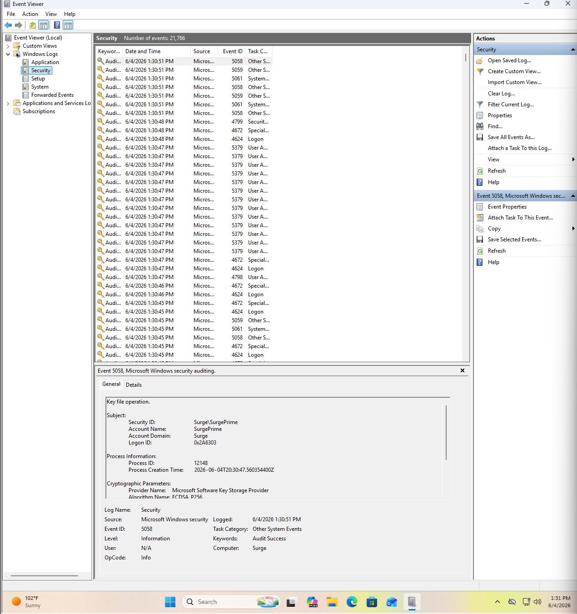

---

## Key Takeaways

This lab demonstrates practical experience with:

- Windows security hardening
- User privilege management
- Endpoint protection
- Disk encryption
- Security auditing
- Troubleshooting Windows security features

These tasks closely align with responsibilities commonly found in Help Desk, Desktop Support, IT Support, and Junior System Administration roles.
